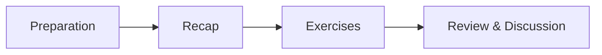

# Welcome

Welcome to the course website for **GMD2** (Game Development 2). This course explores **software design and architecture in the context of game development**. Together, we will examine game programming patterns, engine architecture, and software design principles, equipping you with the skills to build robust and maintainable games.

Use the sidebar to navigate through the course sessions, which include preparation materials and practical exercises.

## Course Structure

The course spans 12 sessions. Each session typically follows this structure:

1.  **Preparation**: Engage with assigned learning paths and readings before class. We cover most theoretical content here to maximize practical time during class.
2.  **Recap**: A focused review of essential concepts to kick off the class.
3.  **Exercises**: Hands-on practice to reinforce and expand your skills.
4.  **Review & Discussion**: Collaborative review of exercises and solutions.

This approach allows you to learn theory at your own pace, enabling us to focus class time on practical application and problem-solving. Active preparation and participation is key to your success in this course.

## Course Overview

Overview of the course content.

## Test Your Knowledge

??? question "What is the difference between a framework and an engine?"
    A framework provides a structure and set of tools for building applications, while an engine is a complete system that handles core functionality like rendering and physics.