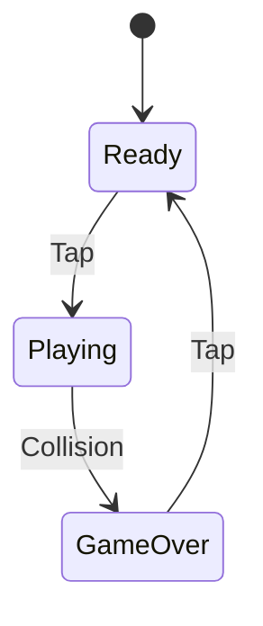
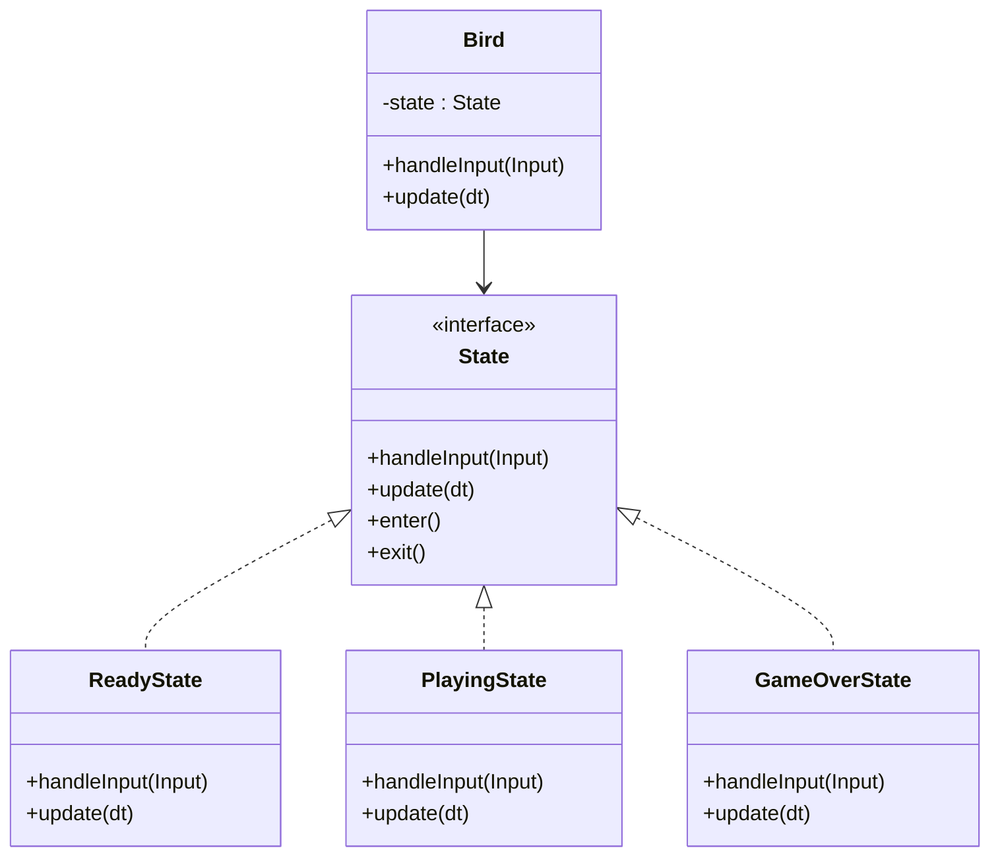

# 02 Flappy Bird

- Images (Sprites)
- Infinite Scrolling
- "Games Are Illusions"
- Class libraries
- Procedural Generation
- Managing State, State Machines
  - State Pattern
- Interfaces ?
- State pattern here or wait for great mario example? (maybe basic here and then involve into state machine)
- Singleton pattern (through the game library core class)
- Service Locator (built-in through GameServices objet on Game class)

## Today's Goal

We look at state management and building out our "game engine" through a class library / building a game engine of reusable components.

## Game Architecture & Design

- [Architecture, Performance, and Games](https://gameprogrammingpatterns.com/architecture-performance-and-games.html)

## State Pattern

[State Pattern](https://gameprogrammingpatterns.com/state.html)

| hello                                                                        |
| :--------------------------------------------------------------------------: |
|                 **Figure 3-1: Lifecycle of a MonoGame game**                 |

