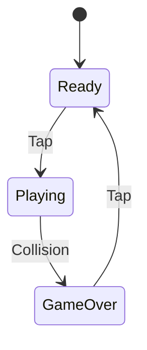
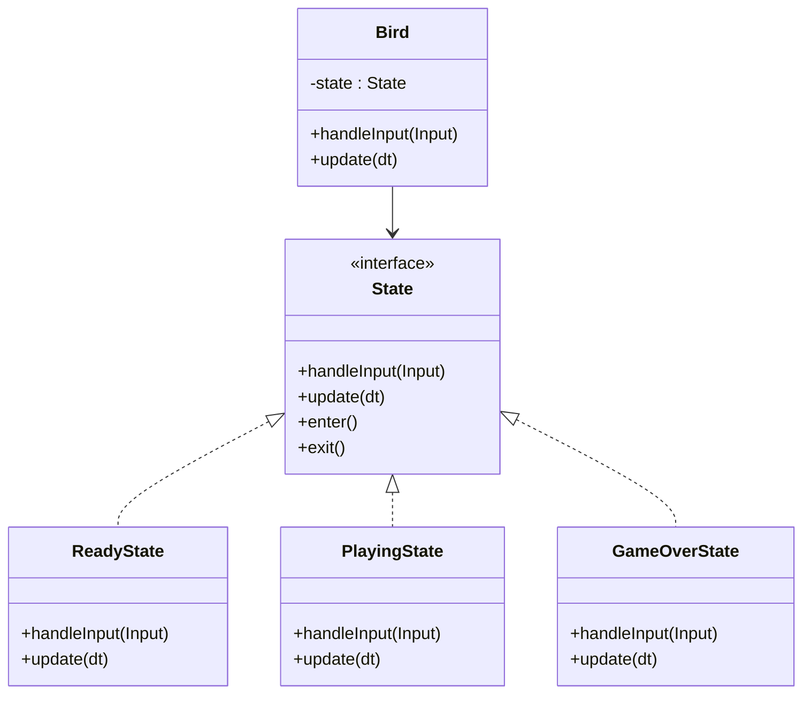

# 02 Flappy Bird

- Game Architecture & Design
- Procedural Generation
- State Machines
- Interfaces

## Game Architecture & Design

- [Architecture, Performance, and Games](https://gameprogrammingpatterns.com/architecture-performance-and-games.html)

## State Pattern

[State Pattern](https://gameprogrammingpatterns.com/state.html)

