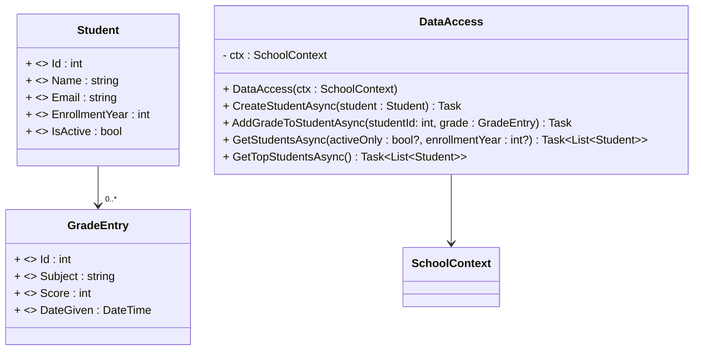

# 05 Super Mario Bros

- Tile Maps
- 2D Animation
- Sprite Art and Palettes (from match3)
- Procedural Level Generation
- Level loading from JSON/XML/Tiled
- Camera
- Platformer Physics
- Basic AI
- Powerups
- Finite State Machines (FSMs)
- State Pattern

